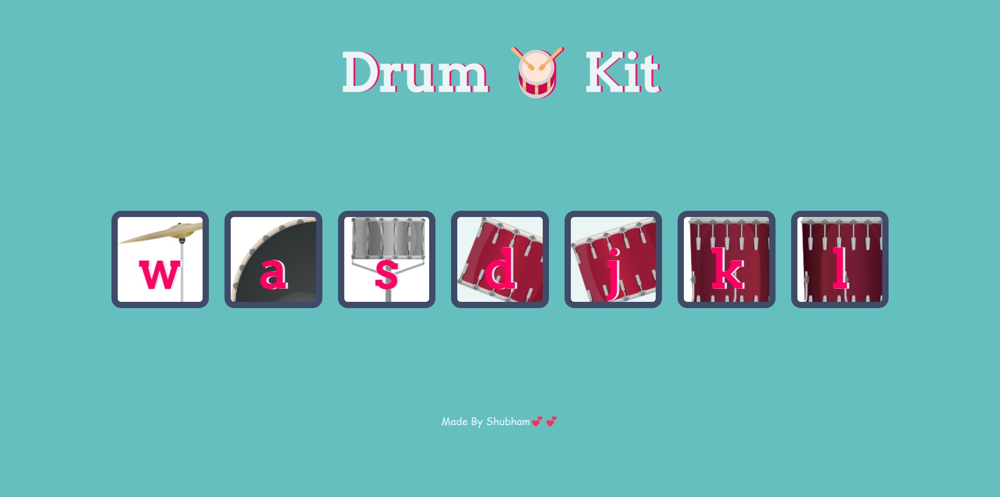

<html lang="en">
<head>
    <meta charset="UTF-8">
    <meta name="viewport"
          content="width=device-width, user-scalable=no, initial-scale=1.0, maximum-scale=1.0, minimum-scale=1.0">
    <meta http-equiv="X-UA-Compatible" content="ie=edge">
   
</head>
<body>
 <h1>Drum Kit</h1>
 
Simple App that play sound of drums by pressing respective keyboard keys or pressing on the buttons on the screen. 

<h3>Technologies used:</h3>
<ul>
    <li>HTML</li>
    <li>CSS</li>
    <li>Javascript</li>
</ul>

</body>
</html>

